# Sony Pictures Data Engineering Demo
## Presentation Guide & Talking Points

---

## Demo Flow (30-45 min)

### 1. THE HOOK (2 min)
> "What if your data platform could handle both real-time fan engagement AND batch box office analytics in the same pipeline, with zero orchestration code?"

**Open with the Streamlit Dashboard** → Show the live pipeline health

---

### 2. MEDALLION ARCHITECTURE OVERVIEW (5 min)

**Talking Points:**
- "3-10-2 model: 3 Bronze, 10 Silver, 2 Gold tables"
- "Each layer has a job - land it, clean it, aggregate it"
- "Schema = security boundary (PII isolated in SECURE schema)"

---

### 3. THE HYBRID PATTERN (10 min) ⭐ KEY DIFFERENTIATOR

**🔥 ONLY SNOWFLAKE:**
> "Other platforms make you choose - Kafka OR batch. Here we run BOTH paradigms in the same warehouse, same governance, same security model."

**When to use each:**
| Use Case | Pattern | Why |
|----------|---------|-----|
| PII routing, conditional splits | Streams/Tasks | Need IF/ELSE logic |
| Linear transformations | Dynamic Tables | Just declare the end state |
| Historical tracking (SCD2) | Tasks + MERGE | Complex update logic |
| Real-time aggregations | Dynamic Tables | `TARGET_LAG = '5 minutes'` |

---

### 4. STREAMS & TASKS DEEP DIVE (7 min)

```mermaid
flowchart LR
    subgraph STREAM["📡 STREAM"]
        ST1[raw_fan_stream<br/>CDC on RAW table]
    end
    
    subgraph TASK_DAG["⏰ TASK DAG"]
        T1[tsk_route_fan_data<br/>SCHEDULE: 1 min] --> T2[tsk_merge_fan_scd2<br/>AFTER: route task]
        T2 --> T3[tsk_update_pii_vault<br/>AFTER: merge task]
    end
    
    STREAM --> TASK_DAG
    
    style STREAM fill:#b3e0ff
    style TASK_DAG fill:#ffe6b3
```

**Demo Script:**
1. Show `SYSTEM$STREAM_HAS_DATA()` - "Only runs when there's new data"
2. Show `INSERT ALL` - "One read, multiple writes - the fan-out pattern"
3. Show task dependencies with `AFTER` - "Built-in orchestration, no Airflow needed"

**🔥 ONLY SNOWFLAKE:**
> "Streams capture changes at zero cost until you consume them. No separate Kafka cluster, no Debezium, no infrastructure."

---

### 5. DYNAMIC TABLES DEEP DIVE (7 min)

```mermaid
flowchart TB
    subgraph DT_CHAIN["🔄 DYNAMIC TABLE CHAIN"]
        DT1[STG_BOX_OFFICE_FLATTEN<br/>TARGET_LAG: 5 min] 
        DT2[STG_BOX_OFFICE_CURRENCY<br/>TARGET_LAG: 5 min]
        DT3[STG_BOX_OFFICE_DEDUP<br/>TARGET_LAG: 5 min]
        DT4[FACT_DAILY_PERFORMANCE<br/>TARGET_LAG: 10 min]
        DT5[AGG_FRANCHISE_PERFORMANCE<br/>TARGET_LAG: 15 min]
        
        DT1 --> DT2 --> DT3 --> DT4 --> DT5
    end
    
    subgraph REFRESH["⚙️ SNOWFLAKE HANDLES"]
        R1[Dependency Graph]
        R2[Incremental Refresh]
        R3[Scheduling]
    end
    
    DT_CHAIN -.-> REFRESH
    
    style DT_CHAIN fill:#e6ffe6
    style REFRESH fill:#f0f0f0
```

**Demo Script:**
1. Show `CREATE DYNAMIC TABLE ... AS SELECT` - "Just write SQL, Snowflake does the rest"
2. Query `INFORMATION_SCHEMA.DYNAMIC_TABLE_REFRESH_HISTORY` - "Full observability"
3. Show incremental refresh - "Only processes changed data"

**🔥 ONLY SNOWFLAKE:**
> "Dynamic Tables figured out the dependency chain automatically. I didn't write a single line of orchestration code."

---

### 6. DATA QUALITY WITH DMFs (5 min)

**Demo Script:**
1. Show DMF definition - "Native SQL, runs on schedule"
2. Query the monitoring results view - "Built-in, no external tool"
3. Show Streamlit dashboard DQ tab - "Executives see this, not raw tables"

**🔥 ONLY SNOWFLAKE:**
> "Data quality is a first-class citizen in the platform. Not a bolt-on, not a separate tool - it's built into the table definition."

---

### 7. dbt INTEGRATION (5 min)

```mermaid
flowchart TB
    subgraph DBT["🔧 dbt PROJECT"]
        direction LR
        M1[models/staging/*]
        M2[models/marts/*]
        M3[snapshots/*<br/>SCD Type 2]
        M4[tests/*<br/>37 tests]
        M5[macros/*<br/>currency_convert]
    end
    
    subgraph BENEFITS["✅ WHY dbt + SNOWFLAKE"]
        B1[Version Control]
        B2[Testing Framework]
        B3[Documentation]
        B4[Environment Mgmt]
    end
    
    DBT --> BENEFITS
    
    style DBT fill:#ff6b6b
    style BENEFITS fill:#4ecdc4
```

**Talking Points:**
- "dbt for engineering workflow, Snowflake for execution"
- "Snapshots give us SCD2 with zero custom MERGE code"
- "Macros ensure everyone uses Finance-approved FX rates"

---

### 8. GOVERNANCE & SECURITY (3 min)

```mermaid
flowchart TB
    subgraph SCHEMAS["🔒 SCHEMA = SECURITY BOUNDARY"]
        RAW[RAW<br/>Data Engineers]
        STG[STG<br/>Data Engineers]
        SECURE[SECURE<br/>Compliance Only]
        DIMS[DIMS<br/>Analysts]
        FACTS[FACTS<br/>Analysts]
        GOLD[STUDIO_OPS / MARKETING<br/>Executives]
    end
    
    RAW --> STG
    STG --> SECURE
    STG --> DIMS
    STG --> FACTS
    DIMS --> GOLD
    FACTS --> GOLD
    
    style SECURE fill:#ff9999
    style GOLD fill:#ffd700
```

**🔥 ONLY SNOWFLAKE:**
> "Same query engine, same governance, same audit trail - whether it's a Stream, Dynamic Table, or dbt model. One platform to secure."

---

### 9. LIVE DEMO FLOW

**Demo Steps:**
1. **Dashboard** → Show current state
2. **Insert Data** → `INSERT INTO RAW.FAN_INTERACTIONS...`
3. **Watch Stream** → `SELECT SYSTEM$STREAM_HAS_DATA('...')`
4. **Trigger Task** → `EXECUTE TASK tsk_route_fan_data`
5. **Check DT** → `SELECT * FROM TABLE(INFORMATION_SCHEMA.DYNAMIC_TABLE_REFRESH_HISTORY(...))`
6. **Dashboard** → Refresh, show new numbers

---

### 10. CLOSING SLIDE

**Closing Statement:**
> "This isn't three tools duct-taped together. It's one platform where your data engineers, analysts, and compliance team all work in the same environment with the same governance."

---

## QUICK REFERENCE: Snowflake-Only Features

| Feature | What It Replaces | Why It Matters |
|---------|------------------|----------------|
| **Streams** | Kafka + Debezium | Zero-cost CDC, no infra |
| **Tasks** | Airflow/Prefect | Built-in orchestration |
| **Dynamic Tables** | dbt + cron + Spark | Declarative pipelines |
| **DMFs** | Great Expectations + Monte Carlo | Native DQ, no bolt-ons |
| **QUALIFY** | Subquery + ROW_NUMBER | Cleaner dedup syntax |
| **INSERT ALL** | Multiple INSERT statements | Single-pass fan-out |
| **Time Travel** | Custom backup scripts | Built-in versioning |

---

## OBJECTION HANDLING

| Objection | Response |
|-----------|----------|
| "We already have Airflow" | "Great for complex DAGs. But for 80% of pipelines, why manage infrastructure when Tasks + DTs handle it natively?" |
| "Databricks does this" | "With Delta Live Tables, yes. But you're managing Spark clusters. Here it's serverless, pay-per-query." |
| "What about cost?" | "Streams are free until consumed. Tasks only run when needed. DTs do incremental refresh. You pay for actual work." |
| "We need real-time" | "Dynamic Tables with TARGET_LAG of 1 minute. Streams process in sub-second. What's your definition of real-time?" |

---

*Dashboard URL: https://app.snowflake.com/SFSENORTHAMERICA/jfoley_demo_awsuswest/#/streamlit-apps/SONY_DE.GOVERNANCE.SONY_PIPELINE_MONITOR*
